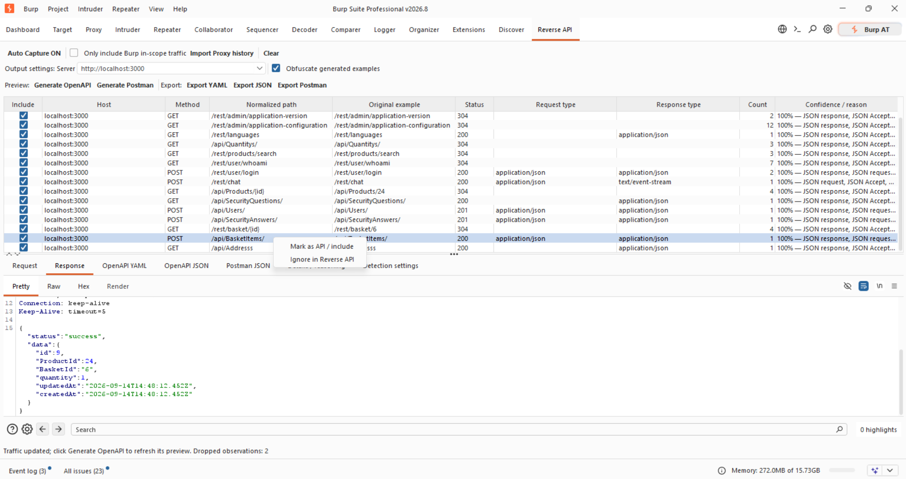

# Reverse API

[](https://github.com/JonsTech/reverse-api-burp/actions/workflows/build.yml)
[](LICENSE)

Reverse API 1.0.0 is a passive Java/Montoya extension for Burp Suite 2026.8. It discovers likely API endpoints in Proxy traffic, supports endpoint review and path normalization, infers observed JSON schemas, and exports OpenAPI 3.1 YAML/JSON or Postman Collection 2.1 JSON.



## Download

Download the JAR attached to the latest [GitHub release](https://github.com/JonsTech/reverse-api-burp/releases). Source builds produce the same loadable artifact under `build/libs/`.

## Build and load

Use JDK 17 (set `JAVA_HOME` to the JDK) and network access for the first build:

```powershell
.\gradlew.bat clean build
```

On macOS/Linux use `./gradlew clean build`. Load **build/libs/ReverseAPI-1.0.0.jar** through **Extensions > Installed > Add > Java**, then open the **Reverse API** tab. The fat JAR includes Jackson, SnakeYAML and RE2/J. Montoya 2026.7 is a compile-only dependency supplied by Burp; its classes are not bundled.

On Windows, if the JDK reports `Unable to establish loopback connection` in a Gradle worker and an `UnixDomainSockets` stack trace, use a short existing writable temporary directory for that build, for example:

```powershell
$env:JAVA_TOOL_OPTIONS = '-Djdk.net.unixdomain.tmpdir=C:/Temp'
.\gradlew.bat clean build
```

## Capture and review

**Auto Capture ON/OFF** controls automatic observations. Capture starts enabled and limited to Burp's Suite-wide target scope. Automatic capture observes responses from Proxy, using their initiating requests. It sends no requests, changes no messages or interception decisions, and never waits for analysis in a Proxy callback. A single background worker processes a bounded queue; oversized or excess observations are dropped rather than blocking traffic. Already queued observations can complete after capture is paused.

Reverse API does not silently scan old traffic when it loads. Use **Import Proxy history** to scan entries captured before the extension was loaded. The current **Only include Burp in-scope traffic** setting is applied, entries without responses are skipped, and repeated clicks do not re-import the same Proxy history IDs. New Proxy responses continue to arrive through Auto Capture.

- Uncheck an operation or use **Ignore in Reverse API** to exclude it. Later traffic preserves that review decision.
- Edit **Normalized path** to correct inferred identifiers. Review edits affect export; future captures remain grouped by their original automatic normalization.
- Use Burp's **Add to Reverse API** / **Ignore in Reverse API** context menus to override automatic detection and scope. A selected request without a response can be added manually.
- The **Request** and **Response** panes use Burp's read-only native HTTP editors, including its applicable Pretty/Raw views, syntax coloring, search and content-aware formatting. They always show captured URLs, header values and bodies, including credentials. The export checkbox never changes these views or the retained samples. Messages are reconstructed from Reverse API's bounded capture model; it does not retain the original HTTP version, response reason phrase or binary bytes.
- The output toolbar separates settings, previews and file exports. **Generate OpenAPI** updates the YAML and JSON previews; **Generate Postman** updates the Postman Collection 2.1 preview. **Export YAML/JSON/Postman** regenerates the relevant output before opening the save dialog. Empty and stale preview tabs explain which action updates them. Pause capture before exporting a busy session; an export is discarded if captures or review choices change during generation.
- **Generate for** controls which single captured server is included in OpenAPI and Postman output. It defaults to the first server observed and lists the other captured servers when more than one is present. This prevents development, staging and production observations from competing for the same OpenAPI path/method. Changing the selection filters generated output only; it does not remove captured traffic.
- **Clear** removes captures and review choices, discards queued observations and resets drop counters. Settings remain. Reloading the extension resets everything.

## Detection settings

Choose **Broad**, **Balanced** or **Strict** detection sensitivity. Balanced is the default. The main controls enable JSON, GraphQL, XML/SOAP and API-path recognition, suppress common static/analytics noise, and optionally retain weak candidates for manual review. XML is identified from media types and SOAP metadata only; no XML parser is used.

Less common signal and filter controls are collapsed under **Advanced settings**. Host and URL filters accept comma-separated `*` and `?` wildcards by default, with visible examples. Expert users can opt into case-insensitive RE2 regular expressions (maximum 1024 characters); lookaround and backreferences are unsupported. Exclusion and host restrictions take precedence over forced inclusion. Settings affect new observations; existing rows are not rescored.

Additional JSON media types accept a comma-separated list and are used for detection and schema inference. Additional API-key header names also accept a comma-separated list. Built-in recognition includes X-Auth-Token, X-Access-Token, common API-key/subscription-key headers and CSRF-token headers. API-Version and useful X-* headers are described without values.

## Normalization and exports

Endpoint identity includes scheme, host, port, method and automatically normalized path. Numeric segments, UUIDs, long hexadecimal and mixed alphanumeric tokens become `{id}`, `{id2}`, etc. Version segments such as `v1`, ordinary names, repeated slashes and trailing slashes remain literal.

OpenAPI includes operation-specific servers, path/query/custom-header parameters, JSON and URL-encoded request schemas, and responses by status. JSON inference handles nested objects, arrays, nullable types and optional fields across retained samples. Required properties mean present in the observed samples, not a verified server requirement. Bodies are not declared required merely because one was observed.

Multipart, XML, binary and unknown bodies are represented by their media type with an unconstrained schema. No XSD, multipart field layout or binary encoding is invented. GraphQL is represented only as its HTTP endpoint and JSON envelope, not a GraphQL schema or separate query/mutation operations.

Bearer, Basic and recognized API-key headers create distinct security schemes and an `x-observed-security` extension on operations. This records evidence, not verified requirements or AND/OR relationships. Cookie presence alone does not prove authentication, so session-cookie schemes are not guessed.

Export rejects duplicate path/method operations across hosts, equivalent path templates, invalid paths, repeated parameter names and unsupported OpenAPI HTTP methods. Resolve conflicts by excluding operations or editing paths; different hosts are never silently overwritten. Requests without an observed response use a `default` response description. These are focused structural checks, not a complete independent OpenAPI conformance validator.

## Export examples and replay

**Obfuscate generated examples** is checked by default and applies to OpenAPI YAML/JSON previews and exports, and Postman Collection JSON previews and exports. Request/response inspection inside Reverse API always shows captured values.

- **Checked:** JSON/form string values and header/query examples are blanked, JSON numbers become zero and booleans false. JSON object/array structure and field names remain. Opaque XML, multipart and other unparsed bodies become empty examples rather than attempting unreliable selective redaction. Postman keeps media types for Content-Type, blanks other header values, and replaces normalized identifiers with empty path variables. Recognized credentials reflected into route or property names still block obfuscated export.
- **Unchecked:** captured values, including passwords, authorization tokens, API keys and cookies, are included. For example, `{ "user": "admin", "pass": "admin" }` stays intact; checked, both strings become empty. This mode deliberately produces sensitive working data for an authorized testing workflow.

OpenAPI contains standard parameter and body examples, plus an `x-captured-exchange` extension in unchecked mode carrying the retained paired URL, headers and text bodies. Importers need not understand this extension, particularly for authentication. Use **Export Postman** for replay: it produces one request and paired response example per included operation, using the latest retained sample. Unchecked Postman export preserves the original captured URL (including repeated query values), headers and body text. Host, Content-Length, Connection, Transfer-Encoding and Proxy-Connection request headers are left for Postman to calculate. The collection explicitly disables inherited auth so captured Authorization/Cookie headers remain usable. Importing does not send requests automatically.

Postman requests use captured URLs even if the review path was edited; OpenAPI uses reviewed normalized paths. Postman supports separate items where OpenAPI would reject host/path conflicts. XML and multipart bodies are copied as opaque text in unchecked mode and never parsed. Binary byte fidelity, HTTP wire formatting, expired sessions, request signatures and server state are not guaranteed: this remains captured evidence, not proof of successful replay. A live Postman import/replay test is not part of the automated suite.

## Privacy and resource limits

Captured values are visible inside Burp. Obfuscation is an export choice, not an access-control boundary. With obfuscation checked, the export metadata check covers common credential names, configured API-key headers and cookies; too many distinct credential values fail closed. With it unchecked, that check is intentionally disabled so captured credentials can be exported.

Raw bounded samples are retained in memory for inference and can contain credentials. Nothing is persisted to a Burp project or sent to an external service. Exported server addresses, route names, parameter names and JSON property names can still contain application-specific sensitive metadata that cannot reliably be recognized from traffic alone. Review paths and the generated document before sharing. This is not a general-purpose data-loss-prevention system.

Limits are 2,000 operations, 25 samples per operation, a 32 MiB estimated retained-data budget, and 32 queued exchanges. Combined request/response wire size above 256 KiB is skipped, as are mapped exchanges above a 512 KiB estimate. Limits deliberately sacrifice completeness; the UI reports dropped observations after refresh/generation. The retained budget is an accounting bound, not a total JVM heap limit: Burp-owned messages, object overhead, schema generation and previews need additional memory. JSON parsing caps nesting at 64; inference caps depth at 32 and visits at 4,096 per sample. Beyond inference limits schemas become unconstrained; malformed JSON contributes no schema.

XML is never parsed, so external entities, DTDs, XInclude and external resources are never resolved. Malformed capture failures are contained in the worker. UI construction and updates run on Swing's event thread, notifications are coalesced, and capture workers/timers are stopped on unload.

## Deliberate limits for 1.0.0

- Capture, configuration and review decisions are session-only. Project persistence is deferred until its lifecycle, compatibility and privacy behavior can be tested in Burp.
- Automatic capture requires a response. Timed-out requests can be added manually; automatic correlation/expiry is deferred.
- The first 25 samples drive inference; later observations increment the count but may introduce unseen statuses or fields. Capture loss is not proof that an endpoint or response does not exist.
- Detection is heuristic. XML, SOAP, RPC and unusual APIs may need manual inclusion; a JSON document can be a false positive.
- GraphQL expansion, XML/XSD inference and detailed multipart parsing are deferred. OpenAPI YAML/JSON and Postman Collection 2.1 JSON are supported.
- No live Burp integration test is part of the automated suite; load and exercise the JAR in Burp before relying on it in an engagement.

## Tests

`clean build` runs regression tests for detection, normalization, review decisions, resource limits, nullable schema merging, export obfuscation and explicit credential inclusion, unredacted Burp previews, Postman paired replay data, malformed traffic, export conflicts, media-type separation, local references and YAML/JSON equivalence. It also checks fat-JAR dependency presence and absence of Montoya classes.

Implementation references: [Montoya HTTP handlers](https://portswigger.github.io/burp-extensions-montoya-api/javadoc/burp/api/montoya/http/handler/HttpResponseReceived.html), [OpenAPI 3.1](https://spec.openapis.org/oas/v3.1.1.html), [RE2/J syntax and behavior](https://github.com/google/re2j), [Postman Collection 2.1](https://schema.postman.com/json/collection/v2.1.0/docs/index.html).

## Maintainer release process

Releases are automated from version tags. Before publishing, update the version in `build.gradle` and the matching entry in `CHANGELOG.md`, merge the change after the `build` check passes, and smoke-test the resulting JAR in Burp Suite.

Create and push an annotated semantic-version tag from the verified `main` commit:

```shell
git tag -a v1.0.0 -m "Reverse API v1.0.0"
git push origin v1.0.0
```

The tag-triggered workflow verifies that the tag matches the project version, rebuilds and tests the extension, then creates the GitHub Release with the JAR and its SHA-256 checksum. Ordinary branch pushes and pull requests never publish releases.

## License

Reverse API is licensed under the [Apache License 2.0](LICENSE). See [third-party notices](THIRD_PARTY_NOTICES.md) for bundled runtime dependencies.
